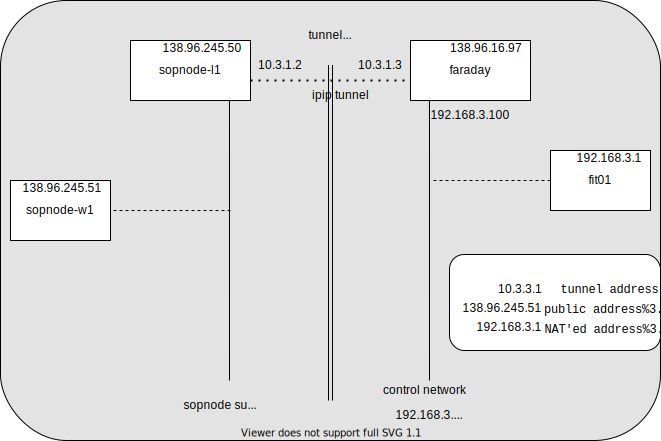

# k8s and crossing the NAT

- [k8s and crossing the NAT](#k8s-and-crossing-the-nat)
  - [problem statement](#problem-statement)
    - [running k8s + konnectivity over the NAT](#running-k8s--konnectivity-over-the-nat)
  - [ideas](#ideas)
    - [VXLAN](#vxlan)
    - [VPN](#vpn)
    - [IP/IP](#ipip)
  - [proposal: the island](#proposal-the-island)
  - [implementation](#implementation)
    - [addressing](#addressing)
      - [sopnode:](#sopnode)
      - [fit:](#fit)
      - [tunnel:](#tunnel)
    - [configuration](#configuration)
      - [faraday](#faraday)
      - [sopnode-l1](#sopnode-l1)
      - [fitxx](#fitxx)
      - [sopnode-wxx](#sopnode-wxx)
    - [making all this persistent](#making-all-this-persistent)
      - [persistent nodes](#persistent-nodes)
      - [fit nodes](#fit-nodes)
    - [DNS](#dns)
    - [testing connectivity](#testing-connectivity)
      - [common](#common)
      - [faraday](#faraday-1)
      - [l1](#l1)
    - [kube-install join](#kube-install-join)
      - [sopnode-wxx](#sopnode-wxx-1)
      - [fitxx](#fitxx-1)

## problem statement

### running k8s + konnectivity over the NAT

I have tried for some long weeks to get a worker node to smoothly join a k8s cluster from behind a NAT;
at first it looked something reasonably achievable, because
* it looks like a pretty standard use case
* the existence of a tool name `konnectivity` was very promising

But to no avail so far. I did deploy konnectivity, and most of the control plane
worked just fine actually; however:
* some pieces of the control plane (like notably `kubectl exec`) exhibited an odd behaviour
* the data plane was not working at all, because the various tunnels created by
  `calico` required un underlying connectivity, that was missing because of the
  NAT


## ideas

### VXLAN

My first idea has been to create my own tunnel between `faraday` and, say,
`sopnode-l1`, using a vxlan

However my first attempts at creating a simplistic vxlan have miserably failed
(see `vxlan.sh`); that code was designed to create a simple vxlan tunnel between
2 R2lab nodes (for tests); it probably almost worked, but well...

### VPN

In the meanwhile, TT found a blog post that described running the k8s software
over a VPN. As much as it looks like a simple solution deployment-wise, we must
agree that the cryptographic/authentication aspect of a VPN seem to be
totally overkill and counterproductive in our own environment, so I have been
trying to find something simpler

### IP/IP

So I decided to give another try at creating a tunnel manually, but using IPIP
this time;  which tuned out very straightforward - more so than vxlan, although
it's hard to find a good reason for that (and it will be no big deal
to replace ipip with vxlan in the future if needed)

## proposal: the island

Leveraging all that, I propose what I believe is the simplest way around the current situation,
which is to create what I call **an island***, i.e. a ***complete connectivity*** between:

* on e the one hand the `sopnode-*` hosts
* and on the other faraday, and its attached nodes

the following archtecture



## implementation

### addressing

| piece | address range |
|-|-|
| sopnode side | 10.3.2.x/24 - here x is the worker number; l1 gets .50
| fit/r2lab side | 10.3.3.x/24 - here x is the fit number
| tunnel | 10.3.1.x/24 - here x is either 1 or 2

#### sopnode:
    10.3.2.50        sopnode-l1-priv
    10.3.2.1         sopnode-w1-priv
    10.3.2.2         sopnode-w2-priv
    10.3.2.3         sopnode-w3-priv

#### fit:
    10.3.3.100     faraday
    10.3.3.1       fit01-priv
    10.3.3.2       fit02-priv
    10.3.3.3       fit03-priv
    10.3.3.4       fit04-priv

#### tunnel:
    10.3.1.2      sopnode-tunnel
    10.3.1.3      faraday-tunnel

### configuration

#### faraday

* tunnel
  ```bash
  ip link add r2lab-sopnode type ipip local 138.96.16.97 remote 138.96.245.50
  ip addr add 10.3.1.3/24 dev r2lab-sopnode
  ip link set dev r2lab-sopnode up
  ```

* private network
  ```bash
  ip addr add 10.3.3.100/24 dev control
  ```

* routing
  ``` bash
  ip route add 10.3.2.0/24 dev r2lab-sopnode
  ```

#### sopnode-l1

* tunnel
  ```bash
  ip link add r2lab-sopnode type ipip local 138.96.245.50 remote 138.96.16.97
  ip addr add 10.3.1.2/24 dev r2lab-sopnode
  ip link set dev r2lab-sopnode up
  ```

* private network
  ```bash
  ip addr add 10.3.2.50/24 dev eth0
  ```

* routing
  ``` bash
  ip route add 10.3.3.0/24 dev r2lab-sopnode
  ```

#### fitxx

* private network
  ```bash
  # e.g. on fit01
  xx=1
  ip addr add 10.3.3.${xx}/24 dev control
  ip route add 10.3.1.0/24 dev control via 10.3.3.100
  ip route add 10.3.2.0/24 dev control via 10.3.3.100
  ```

#### sopnode-wxx

* private-network
  ```bash
  # e.g. on w2
  xx=2
  ip addr add 10.3.2.${xx}/24 dev eth0
  ip route add 10.3.1.0/24 dev eth0 via 10.3.2.50
  ip route add 10.3.3.0/24 dev eth0 via 10.3.2.50
  ```

### making all this persistent

everything super volatile for now; if that flies, we'll need to find a way to

* have this persistent on the wired side
* provide a command for nodes to join the island network before they can join the cluster

#### persistent nodes

i.e. `faraday` and `sopnode-*` : using a systemd service

#### fit nodes

users will need to use the `join-island-network` bash command
located in `kube-install/bash-utils/sopnode.sh`
- requires to have called the `ki-utils` alias beforehand, or to have loaded `/root/kube-install/bash-utils/loader.sh`


### DNS

creating some DNS entries might make our life (a lot) easier;
* on the R2lab side it's easy, as we run dnsmasq
* on the sopnode side, we might leverage the .pl.sophia.inria.fr DNS domain ?
  would it make sense to ask for a .sopnode.inria.fr domain ?

### testing connectivity

#### common

#### faraday

```bash
test-island; p1v 10.3.1.2 TUNNEL
```

#### l1

```bash
test-island; p1v 10.3.1.3 TUNNEL
```

### kube-install join

#### sopnode-wxx

```bash
# joining the cluster on l1
ki join-cluster r2lab@10.3.2.50

# joining the cluster on w2
ki join-cluster r2lab@10.3.2.2
```

#### fitxx

**IMPORTANT** we need to get calico to use the `10.3.3.x` address; otherwise it will still use `192.168.3.x`

```bash
xx=1
export IP=10.3.3.${xx}
# then same
```
