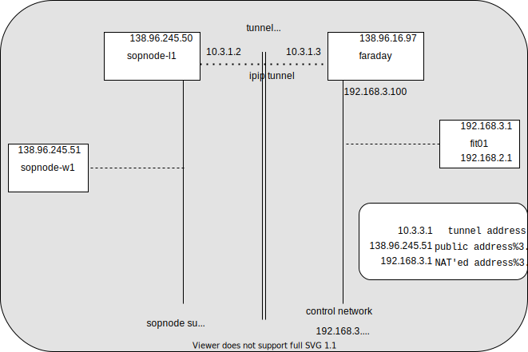

# k8s and crossing the NAT

- [k8s and crossing the NAT](#k8s-and-crossing-the-nat)
  - [problem statement](#problem-statement)
    - [running k8s + konnectivity over the NAT](#running-k8s--konnectivity-over-the-nat)
  - [ideas](#ideas)
    - [VXLAN](#vxlan)
    - [VPN](#vpn)
    - [IP/IP](#ipip)
  - [proposal: the tunnel](#proposal-the-tunnel)
  - [implementation](#implementation)
    - [addressing](#addressing)
  - [configuration and usage](#configuration-and-usage)
    - [wired nodes](#wired-nodes)
    - [FIT nodes](#fit-nodes)
    - [testing connectivity](#testing-connectivity)
    - [DNS](#dns)

## problem statement

### running k8s + konnectivity over the NAT

I have tried for some long weeks to get a worker node to smoothly join a k8s
cluster from behind a NAT; at first it looked something reasonably achievable,
because

* it looks like a pretty standard use case
* the existence of a tool name `konnectivity` was very promising

But to no avail so far. I did deploy konnectivity, and most of the control plane
worked just fine actually; however:

* some pieces of the control plane (like notably `kubectl exec`) exhibited an
  odd behaviour
* the data plane was not working at all, because the various tunnels created by
  `calico` required un underlying connectivity, that was missing because of the
  NAT

## ideas

### VXLAN

My first idea has been to create my own tunnel between `faraday` and, say,
`sopnode-l1`, using a vxlan

However my first attempts at creating a simplistic vxlan have miserably failed
(see `vxlan.sh`); that code was designed to create a simple vxlan tunnel between
2 R2lab nodes (for tests); it probably almost worked, but well...

### VPN

In the meanwhile, TT found a blog post that described running the k8s software
over a VPN. As much as it looks like a simple solution deployment-wise, we must
agree that the cryptographic/authentication aspect of a VPN seem to be
totally overkill and counterproductive in our own environment, so I have been
trying to find something simpler

### IP/IP

So I decided to give another try at creating a tunnel manually, but using IPIP
this time;  which tuned out very straightforward - more so than vxlan, although
it's hard to find a good reason for that (and it will be no big deal
to replace ipip with vxlan in the future if needed)

## proposal: the tunnel

Leveraging all that, I propose what I believe is the simplest way around the
current situation, which is to artificially create a ***complete
connectivity*** between:

* on e the one hand the `sopnode-*` hosts
* and on the other faraday, and its attached nodes

Thanks to the following archtecture

**note** in here the node `sopnode-l1` **is fixed**; its peering configuration
with faraday is static; even when running a dev k8s cluster with, say,
`sopnode-w2` as the master, it is **always `sopnode-l1`** that runs the tunnel.

## implementation

in a first attempt we had deployed a second IP address on each side; it was
cumbersome and not working, so let's keep it as simple as it gets:

### addressing

| piece | address range |
|-|-|
| sopnode side | their usual public IP
| fit/r2lab side | their usual NAT'ed IP
| tunnel | 10.3.1.x/24 - here x is either 1 or 2

    10.3.1.2      sopnode-tunnel
    10.3.1.3      faraday-tunnel

## configuration and usage

the code for joining is in `tunnel.sh`

### wired nodes
plan is to have the permanent/wired boxes (faraday+sopnode*) eventually do that
at boot-time using a systemd service named `sopnode-tunnel` (*ongoing..*)

### FIT nodes
mostly fit nodes will need to call `join-tunnel` before joining the cluster

the command is located in `kube-install/bash-utils/tunnel.sh`  
2 ways to call this:

* interactively: first invoke the `ki-utils` alias beforehand
* or load `/root/kube-install/bash-utils/loader.sh`

as an example, see `tests/all-in-one.sh` to see how the tests activate this command

### testing connectivity

use `test-tunnel` (in `tunnel.sh` too) to check for connectivity;

the assumption is that one FIT node is up and configured; no argument if run
form a fit node; expects one argument otherwise; (example, if fit06 is the
testnode, run `test-tunnel 6`)

### DNS

the only extra addresses used in this scheme, as compared to the no-tunnel
situation, are the 2 tunnel endpoints (see above); which in addition are not
exactly useful in day-to-day operations; so no change were made to the DNS names
(we can only add names in the `.pl.sophia.inria.fr` domain, so that would be
hardly helpful...)
